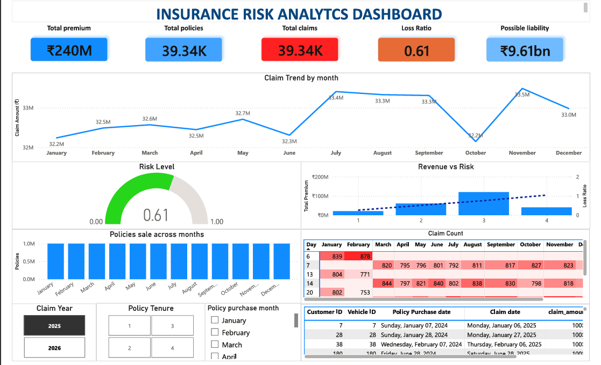

# 🚗 Insurance Portfolio Risk & Claims Analytics

## 📌 Project Overview

Insurance companies must constantly monitor **claims, premium revenue, and portfolio risk** to maintain profitability.

This project simulates and analyzes a large-scale insurance dataset to evaluate **claim behavior, loss ratios, and potential financial exposure** within an insurance portfolio.

The analysis replicates a realistic **business intelligence workflow** used by data analysts in insurance and fintech organizations.

The project involves:

📊 Large-scale dataset simulation  
🗄 Database-driven analysis  
📈 Risk and profitability evaluation  
📉 Interactive dashboard reporting  

The dataset contains **1,000,000 simulated insurance policies** and corresponding claim records.

---

# 🎯 Business Problem

Insurance portfolios become financially unstable when **claim costs exceed premium revenue**.

Key questions addressed in this project:

- How much **premium revenue** was generated from policy sales?
- How do **claim costs evolve over time**?
- Which **policy tenures are more profitable**?
- What is the **portfolio loss ratio**?
- What **future claim liabilities** may exist?
- How would **increasing claim frequency impact profitability**?

By answering these questions, insurers can make better decisions related to:

- pricing strategies  
- risk management  
- underwriting policies  
- portfolio optimization  

---

# 🧠 Analytical Approach

The project follows a typical **data analytics pipeline**:

```
Data Simulation → Database Storage → SQL Analysis → Dashboard Visualization
```

Each stage mirrors the workflow used by professional **business intelligence teams**.

---

# 🛠 Tools & Technologies

| Stage | Tool | Purpose |
|------|------|------|
| Data Simulation | Python (Pandas, NumPy) | Generate synthetic insurance datasets |
| Database | PostgreSQL | Store structured datasets |
| Data Analysis | SQL | Perform business analytics queries |
| Visualization | Power BI | Build interactive analytics dashboards |

---

# 📂 Dataset Description

## 📄 Policy Sales Dataset

The policy dataset represents **1 million insurance policies sold during 2024**.

Each policy includes:

- Customer_ID  
- Vehicle_ID  
- Vehicle_Value  
- Premium  
- Policy_Purchase_Date  
- Policy_Start_Date  
- Policy_End_Date  
- Policy_Tenure  

### 📊 Policy Tenure Distribution

| Tenure | Distribution |
|------|------|
| 1 Year | 20% |
| 2 Years | 30% |
| 3 Years | 40% |
| 4 Years | 10% |

Premium pricing rule:

```
Premium = ₹100 × Policy Tenure (years)
```

---

## ⚠ Claims Dataset

Claims were generated using predefined **risk scenarios**.

### 📅 Claims in 2025

Vehicles purchased on these dates had higher failure risk:

```
7th
14th
21st
28th
```

📌 30% of such vehicles filed claims.

Claim value:

```
₹10,000
```

---

### 📅 Claims in 2026

Between:

```
Jan 1 – Feb 28, 2026
```

10% of **4-year tenure policies** filed claims.

This models long-term policy risk.

---

# 📊 Key Business Metrics Analyzed

The following insurance metrics were calculated using SQL:

### 💰 Total Premium Revenue

Total premium collected from policy sales.

---

### 📉 Monthly Claim Costs

Tracking claim costs by **year and month** helps identify periods of high claim activity.

---

### 📊 Loss Ratio by Policy Tenure

Loss Ratio formula:

```
Loss Ratio = Total Claims / Total Premium
```

Example results from the analysis:

| Policy Tenure | Loss Ratio |
|------|------|
| 1 Year | 3.90 |
| 2 Years | 1.97 |
| 3 Years | 1.33 |
| 4 Years | 3.46 |

📌 A loss ratio greater than **1** means claim costs exceed premium revenue.

The analysis shows that **3-year policies perform relatively better compared to other tenures**.

---

# 🔮 Future Claim Liability Estimation

To estimate potential risk exposure, we assumed:

> Every policyholder who has not yet filed a claim may eventually file one claim during the remaining policy tenure.

Estimated liability:

```
Future Liability = Remaining Policies × Claim Amount
```

This helps insurers forecast **future financial obligations**.

---

# 📈 Scenario Analysis

A risk scenario was simulated where:

```
Claim frequency increases by 5% annually
```

Potential impact:

📉 Higher claim costs  
📉 Increased loss ratios  
⚠ Reduced portfolio profitability  

This demonstrates the importance of **risk monitoring and pricing adjustments** in insurance analytics.

---

# 📊 Interactive Dashboard

A **Power BI dashboard** was developed to explore insights visually.

### Dashboard Capabilities

📊 Portfolio KPIs  
📈 Monthly claim trends  
💰 Profitability by policy tenure  
📉 Policy sales distribution  
🔍 Interactive filters for exploration  

Example dashboard preview:



---

# 💡 Key Insights

✔ Claims cluster around specific vehicle purchase dates.  
✔ Longer tenure policies generate higher premium revenue.  
✔ Certain tenure groups exhibit **very high loss ratios**, indicating pricing risk.  
✔ Monitoring claim frequency is critical for maintaining portfolio profitability.

---

# 📁 Project Structure

```
insurance-portfolio-risk-analytics
├── Python scripts
│   ├── claims.py
│   └── plicy.py
│
├── SQL
│    ├── Q3.1.Total_premium.sql
│    └── Q3.2.Claim_cost.sql
│    └── Q3.3.Claim_ratio.sql
│    └── Q3.4.claim_ratio_monthly.sql
│    └── Q3.5.claim_liability.sql
│    └── Q3.6.1.premium_earned.sql
│    └── Q3.6.2_monthly_premium.sql
│    └── Q4.3.Portfolio_loss_ratio.sql
│    └── Q4.4.Projected_claim_cost.sql
│
├── dashboard
│   ├── insurance_dashboard.pbix
│   └── insurance_dashboard.pdf
│
├── data
│   ├── policy_sales.csv
│   └── claims_data.csv
│
│── images
│    └── dashboard_preview.png
│
└── report
     └── Insurance_analytics_report.pdf


```

---

# 🔁 Reproducing the Analysis

To replicate this project:

1️⃣ Generate datasets using Python scripts  
2️⃣ Import datasets into PostgreSQL  
3️⃣ Run SQL queries for analysis  
4️⃣ Connect Power BI to PostgreSQL  
5️⃣ Explore insights through the dashboard  

---

# 👨‍💻 Author

**Sai Teja Chandaka**

🔗 LinkedIn: https://linkedin.com/in/teja-chandaka-a9h9  
💻 GitHub: https://github.com/teja9677

---
